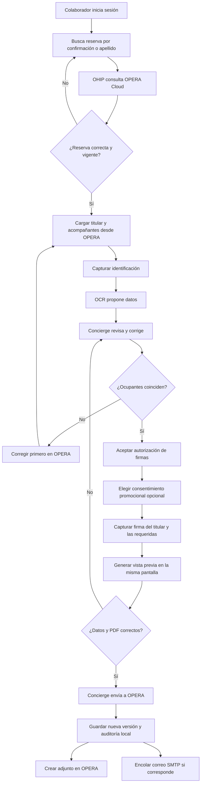
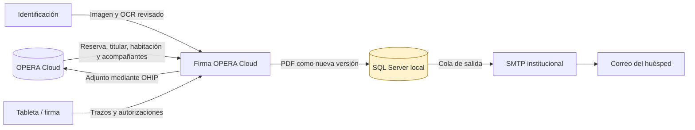
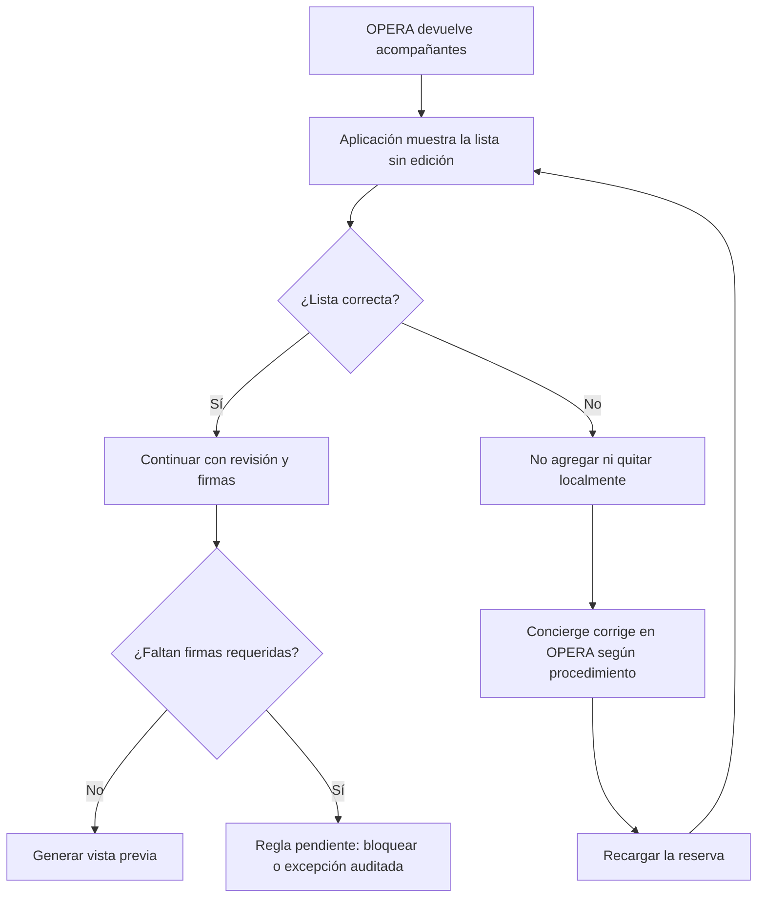
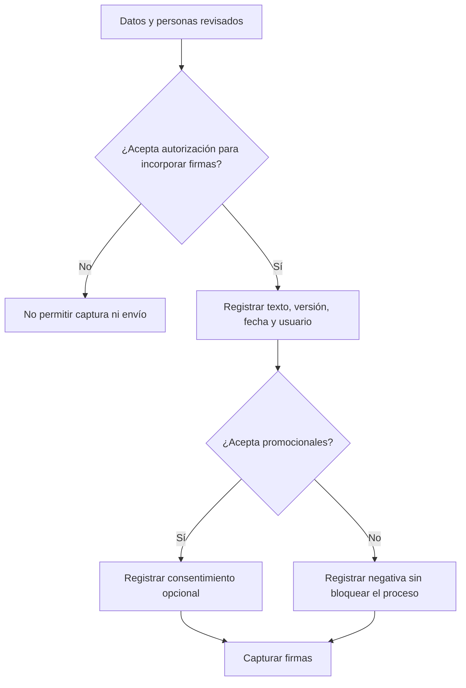
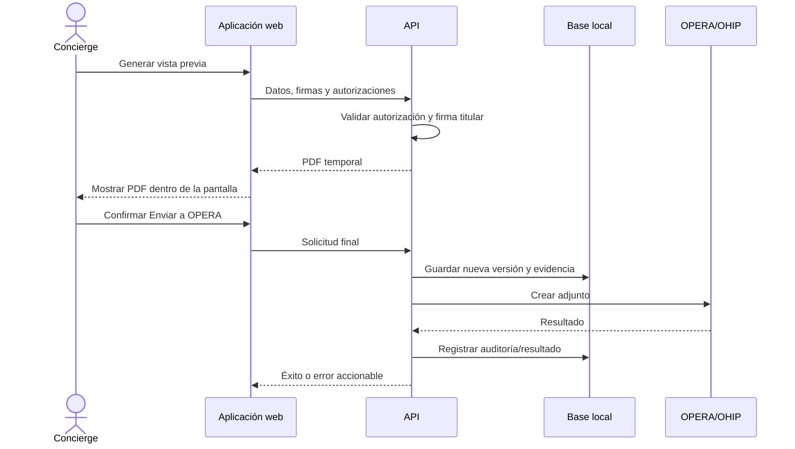
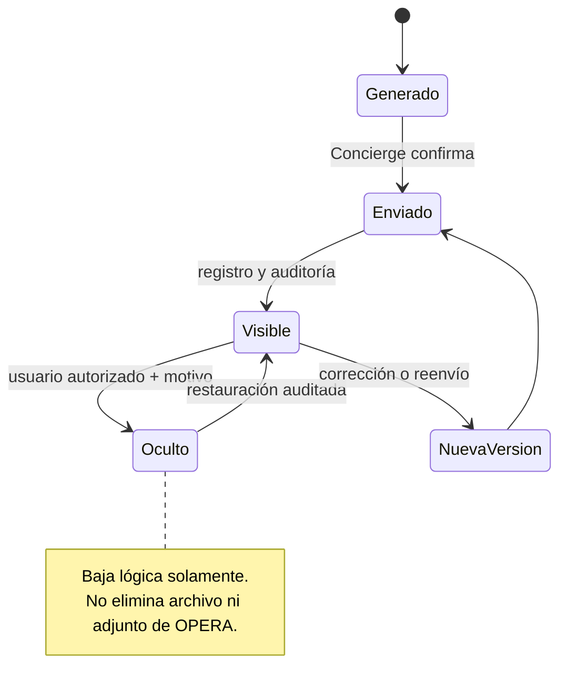
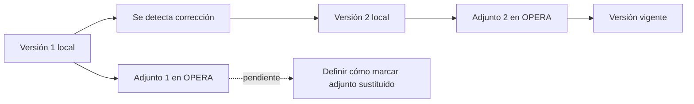
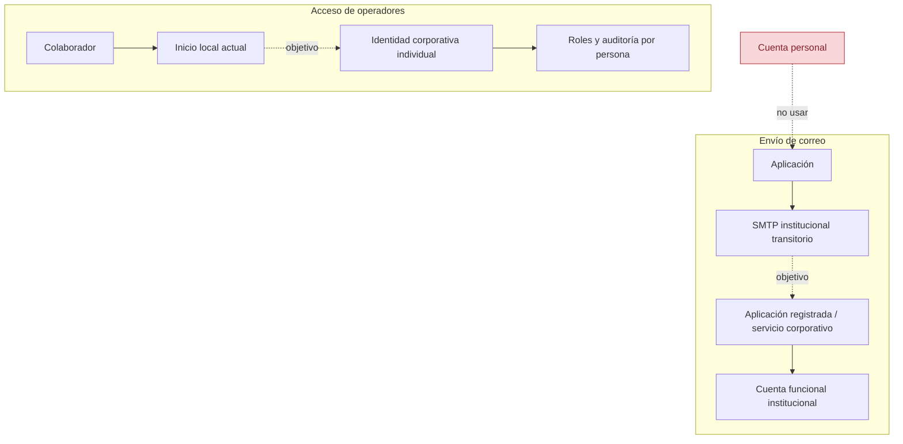
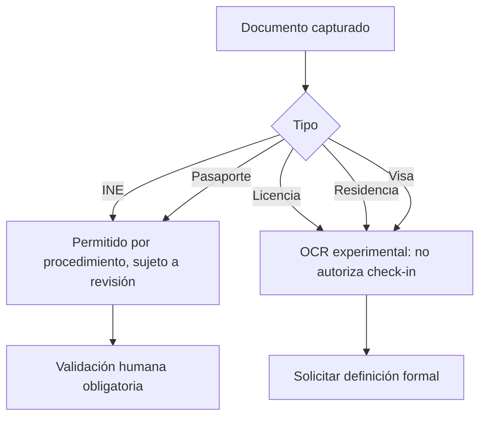
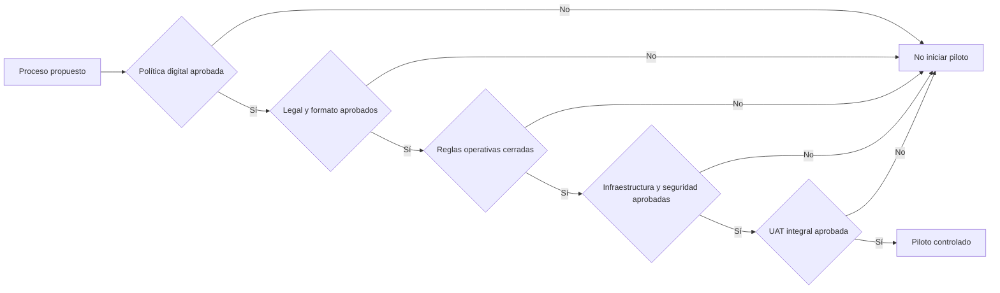

# Documento visual para validación

## Firma OPERA Cloud

**Versión:** 0.1 — 23 de septiembre de 2026  
**Rama:** `documentacionyaprobacion`  
**Estado:** propuesta para revisión y aprobación

Este documento resume visualmente el proceso detallado en `DOCUMENTO_MAESTRO_PROCESO_FIRMA_OPERA_CLOUD.md`. Los diagramas están en Mermaid para que puedan mantenerse junto con el código.

## 1. Flujo operativo de una página

## 2. Fuente y destino de los datos

La ubicación definitiva de SQL Server, respaldos y soporte está pendiente. Los datos escritos en la tarjeta no actualizan por sí mismos el perfil de OPERA.

## 3. Regla propuesta para acompañantes

Por validar con María Guadalupe (Lupita): altas/bajas, menores, edades, capacidad, firmas obligatorias y llegadas posteriores.

## 4. Autorizaciones

Los textos son una propuesta técnica y requieren aprobación de Legal/Privacidad antes del piloto.

## 5. Secuencia de vista previa y envío

## 6. Ciclo de vida de un documento

## 7. Corrección y reenvío

El comportamiento actual conserva el historial y crea otro adjunto. Operación e Integraciones deben aprobar cómo se identifica la versión vigente en OPERA.

## 8. Decisión de identidad y correo

## 9. Semáforo de avance

| Estado | Elementos |
|---|---|
| 🟢 Implementado | Vista previa interna; SMTP activable sin reinicio; autorización de firma; consentimiento promocional separado; acompañantes sin edición; ocultar/restaurar documentos; OCR ampliado; menús no autorizados ocultos |
| 🟡 Requiere UAT | Envío SMTP real; integración OHIP; migración SQL; compilación Angular; tabletas físicas; firma y PDF completos; seguridad y permisos |
| 🟠 Requiere decisión | Acompañantes y menores; firmas faltantes; identificadores; datos a OPERA; correo definitivo; identidad; servidor/BD; versiones de adjuntos |
| 🔴 Bloqueo de piloto | Autorización del tratamiento digital frente a la política 2015; aprobación Legal del formato, textos, retención y documentos admitidos |

## 10. Documentos de identidad

## 11. Puertas de aprobación

## 12. Validaciones solicitadas a María Guadalupe (Lupita)

1. Confirmar si la aplicación puede agregar/quitar acompañantes o debe reflejar únicamente OPERA.
2. Definir inclusión de menores, edades aplicables y quién firma.
3. Definir si puede enviarse una tarjeta sin todas las firmas de acompañantes.
4. Confirmar el identificador operativo: número de confirmación, CRS, `reservationId`, habitación y vigencia.
5. Confirmar si nacionalidad, ciudad, estado y país deben escribirse en OPERA.
6. Aprobar el tratamiento de correcciones, tarjetas reenviadas y adjuntos anteriores.

## 13. Firma de validación

| Área | Nombre y firma | Decisión | Fecha |
|---|---|---|---|
| María Guadalupe / Operación |  | Aprobar / Condicionar / Rechazar |  |
| Operación Hotelera |  | Aprobar / Condicionar / Rechazar |  |
| Legal / Privacidad |  | Aprobar / Condicionar / Rechazar |  |
| Seguridad de la Información |  | Aprobar / Condicionar / Rechazar |  |
| Infraestructura / DBA |  | Aprobar / Condicionar / Rechazar |  |
| Integraciones OPERA/OHIP |  | Aprobar / Condicionar / Rechazar |  |
| Contraloría |  | Aprobar / Condicionar / Rechazar |  |

La aprobación visual debe acompañarse del documento maestro, donde se describen las condiciones, criterios de aceptación y decisiones D-01 a D-14.
